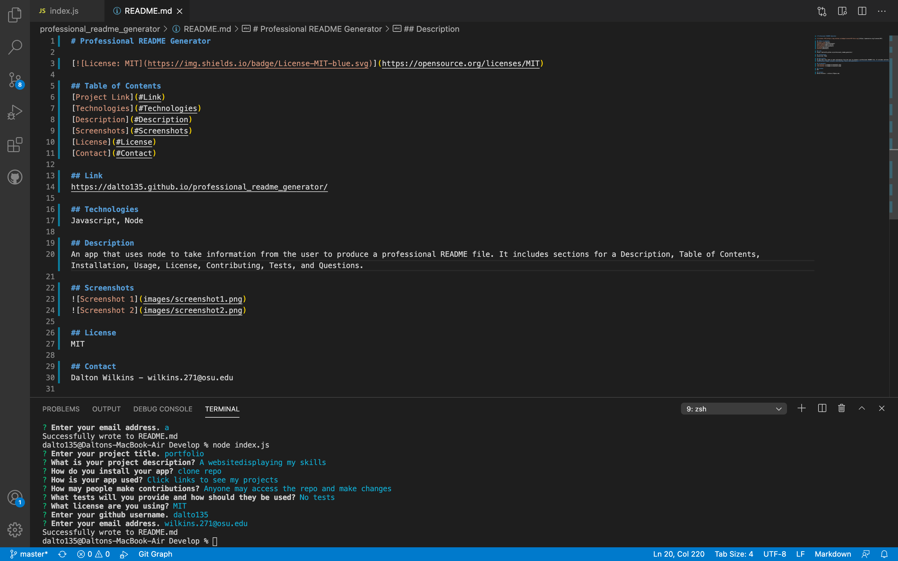

# Professional README Generator

## Table of Contents
[Technologies](#Technologies)  
[Description](#Description)  
[Screenshots](#Screenshots)  
[Video](#Video)  
[License](#License)  
[Contact](#Contact)

## Technologies
Javascript, Node.js

## Description
An app that uses Node.js to take information from the user to produce a professional README file. It includes sections for a Description, Table of Contents, Installation, Usage, License, Contributing, Tests, and Questions.

## Screenshots

## Video
[Link](https://drive.google.com/file/d/1xf-MWEYw272LeOLWWB3GVT3qa4BWIgKK/view)

## License
MIT

## Contact
Dalton Wilkins - daltongh@gmail.com
